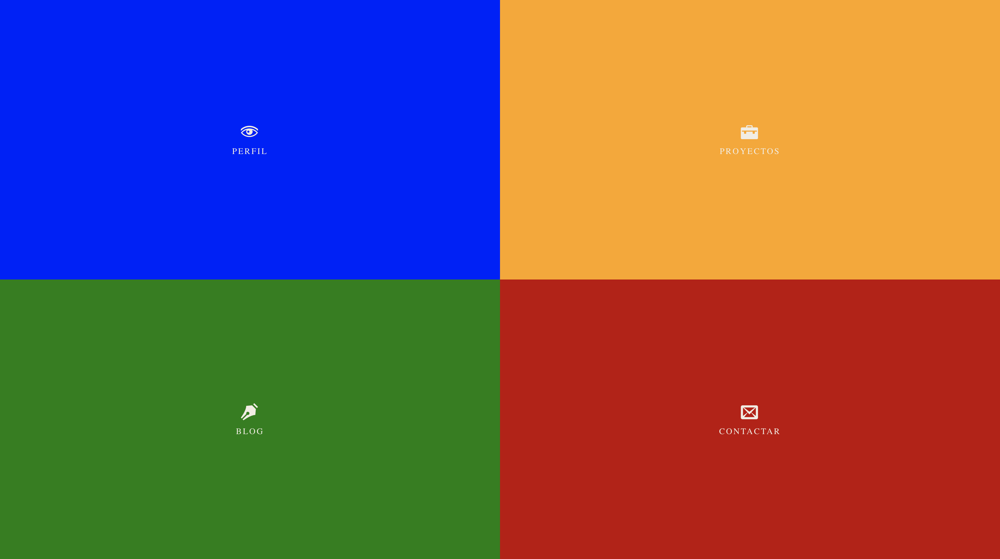

# myp-layout
Mi portfolio con transiciones en CSS3

## ScreenShoot

Mi portfolio con transiciones en CSS3

Cuatro cajas de texto que haciendo clic en cada una, se redimensiona a pantalla completa mediante transiciones, se puede navegar entre proyectos sin refrescar la página.

Si te gusta la idea inicial, te animo a mejorarla, suma tu propuesta al proyecto.

Se acepta todo tipo de pull request, nuestra intención de base sobre este repositorio es el entrenamiento y uso de buenas practicas con Git y GitHub. 

[demo](https://estebanrfp.github.io/myp-layout)

Esteban Fuster Pozzi / @estebanrfp

Visite nuestro portal de tecnologías para la web:

[desarrolloactivo.com](https://desarrolloactivo.com)